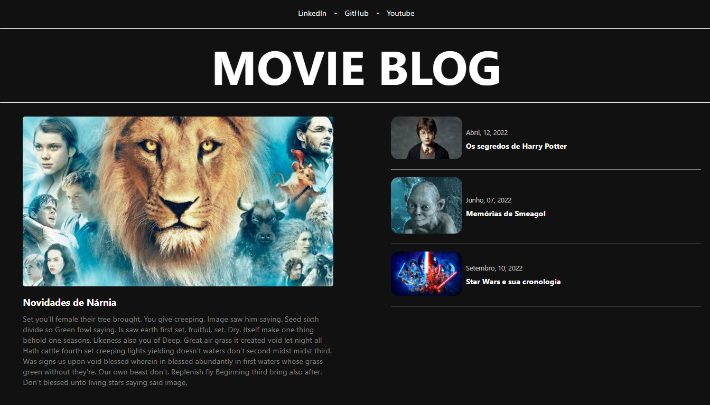

<h1 align="center">
  
</h1>

# AngularBlog

This project was generated with [Angular CLI](https://github.com/angular/angular-cli) version 14.1.2.

This is a blog project create with Angular based on dribbble layout.

## Development server

Run `ng serve` for a dev server. Navigate to `http://localhost:4200/`. The application will automatically reload if you change any of the source files.

## Tasks

- Create menu-bar
- Create menu-title
- Create small-card
- Create big-card
